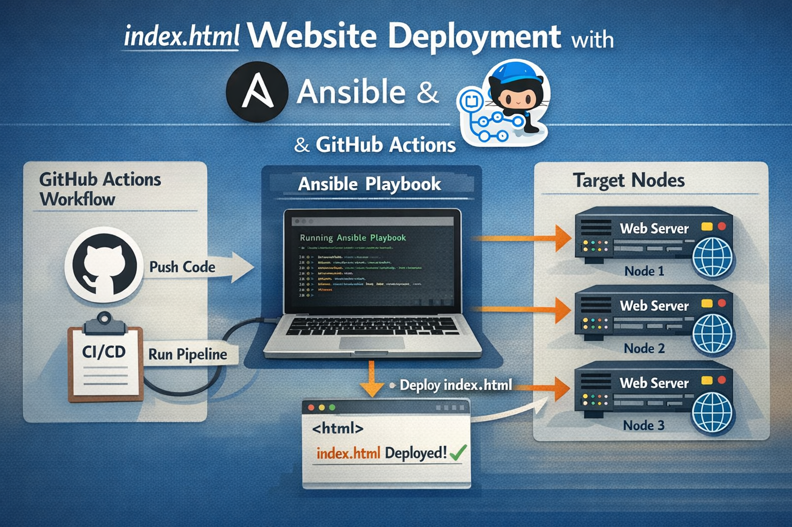
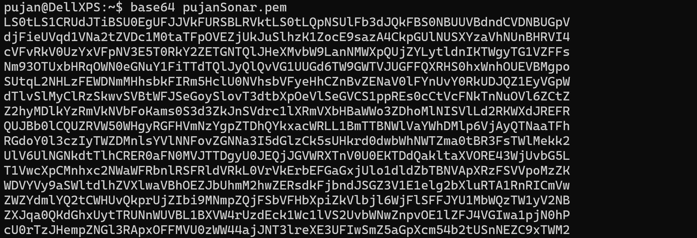
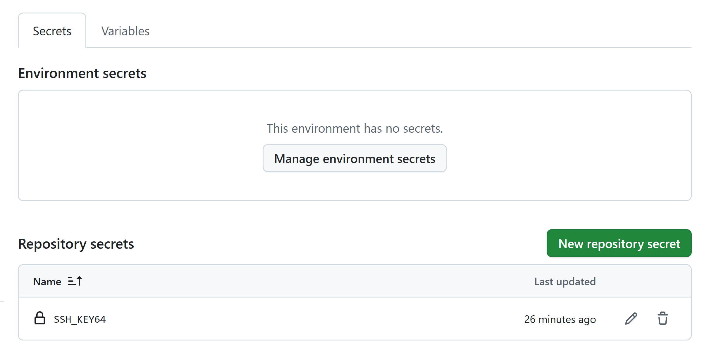
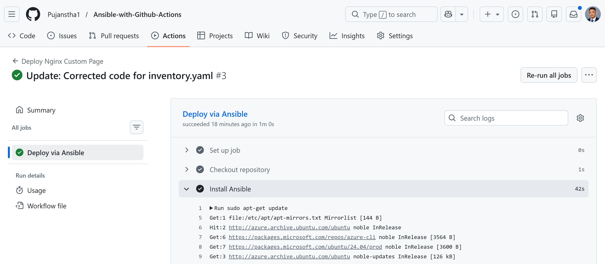
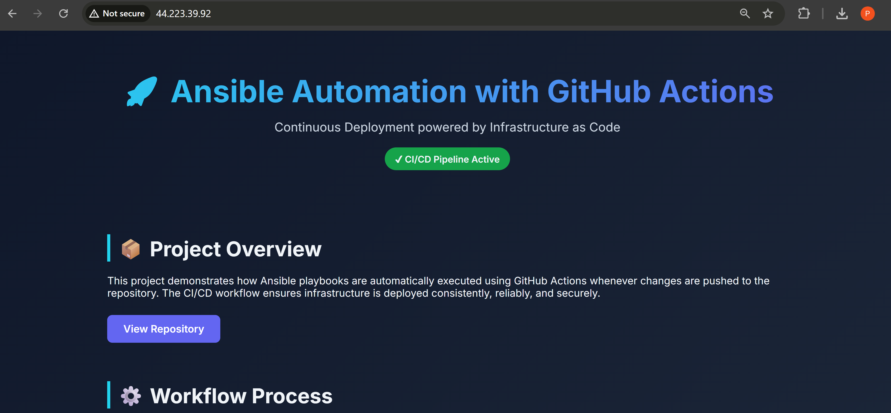

# Ansible CI/CD with GitHub Actions

Automated deployment of Nginx web servers to EC2 instances using Ansible playbooks triggered by GitHub Actions.




---

## Table of Contents

- [Overview](#overview)
- [Architecture](#architecture)
- [Project Structure](#project-structure)
- [File Breakdown](#file-breakdown)
- [Setup Instructions](#setup-instructions)
- [How It Works](#how-it-works)
- [Usage](#usage)
- [Troubleshooting](#troubleshooting)

---

## Overview

This project demonstrates **Infrastructure as Code (IaC)** principles by automating the deployment of custom Nginx web pages to EC2 instances. Every time you push changes to the repository, GitHub Actions automatically triggers an Ansible playbook that deploys your updates to all configured servers.

**Key Benefits:**
- Automated deployments on every push
- Consistent configuration across multiple servers
- Version-controlled infrastructure
- Zero-downtime updates
- Easy rollback capabilities

---

## 🏗 Architecture

```
┌─────────────────┐
│  Developer      │
│  Makes Changes  │
└────────┬────────┘
         │
         ▼
┌─────────────────┐
│  Git Push to    │
│  Main Branch    │
└────────┬────────┘
         │
         ▼
┌─────────────────────────┐
│  GitHub Actions         │
│  Workflow Triggered     │
│  (.github/workflows/    │
│   deploy.yaml)          │
└────────┬────────────────┘
         │
         ▼
┌─────────────────────────┐
│  Runner Environment     │
│  1. Checkout code       │
│  2. Install Ansible     │
│  3. Configure SSH       │
│  4. Decode SSH key      │
└────────┬────────────────┘
         │
         ▼
┌─────────────────────────┐
│  Ansible Playbook       │
│  Execution              │
│  (playbook-custom.yaml) │
└────────┬────────────────┘
         │
         ▼
┌─────────────────────────┐
│  Target EC2 Instances   │
│  - ser001: 54.227.46.44 │
│  - ser002: 44.223.39.92 │
│                         │
│  Nginx + index.html     │
└─────────────────────────┘
```

---

## Project Structure

```
.
├── .github/
│   └── workflows/
│       └── deploy.yaml          # GitHub Actions workflow configuration
├── index.html                   # Custom webpage to deploy
├── inventory.yaml               # Ansible inventory (target hosts)
├── playbook-custom.yaml         # Ansible playbook (deployment logic)
└── README.md                    # This documentation
```

---

## File Breakdown

### 1. `.github/workflows/deploy.yaml`

**Purpose:** GitHub Actions workflow that orchestrates the entire CI/CD pipeline.

**What it does:**

```yaml
name: Deploy Nginx Custom Page

on:
  push:
    branches:
      - main
```
- **Trigger:** Activates automatically when code is pushed to the `main` branch

```yaml
jobs:
  deploy:
    name: Deploy via Ansible
    runs-on: ubuntu-latest
```
- **Runner:** Creates a fresh Ubuntu environment to execute the workflow

```yaml
steps:
  - name: Checkout repository
    uses: actions/checkout@v4
```
- **Step 1:** Downloads your repository code to the runner

```yaml
  - name: Install Ansible
    run: |
      sudo apt-get update
      sudo apt-get install -y ansible
```
- **Step 2:** Installs Ansible automation tool on the runner

```yaml
  - name: Configure SSH
    run: |
      mkdir -p ~/.ssh
      chmod 700 ~/.ssh
      echo -e "Host *\n\tStrictHostKeyChecking no\n" > ~/.ssh/config
      chmod 600 ~/.ssh/config
```
- **Step 3:** Configures SSH to accept connections without manual host verification

```yaml
  - name: Setup SSH private key
    run: |
      echo "${{ secrets.SSH_KEY64 }}" | base64 -d > mykey.pem
      chmod 400 mykey.pem
```
- **Step 4:** Decodes the base64-encoded SSH private key from GitHub Secrets and saves it as `mykey.pem`
- **Security:** The private key is stored securely in GitHub Secrets (never in code)

```yaml
  - name: Deploy using Ansible
    run: |
      ansible-playbook -i inventory.yaml playbook-custom.yaml \
        --private-key mykey.pem
```
- **Step 5:** Executes the Ansible playbook using the inventory file and SSH key

---

### 2. `inventory.yaml`

**Purpose:** Defines target servers where Ansible will deploy the application.

```yaml
ec2_nodes:
  hosts:
    ser001:
      ansible_host: 54.227.46.44
      ansible_port: 22
      ansible_user: ubuntu
      ansible_ssh_common_args: '-o StrictHostKeyChecking=no'
```

**Breakdown:**
- `ec2_nodes`: Host group name containing all EC2 servers
- `ser001` and `ser002`: Friendly names for each server
- `ansible_host`: Public IP address of the EC2 instance
- `ansible_port`: SSH port (default 22)
- `ansible_user`: Username to connect with (Ubuntu AMI default user)
- `ansible_ssh_common_args`: Disables SSH host key checking for automation

**Note:** The `ansible_ssh_private_key_file` line is commented out because the key is passed via command line in the workflow.

---

### 3. `playbook-custom.yaml`

**Purpose:** Ansible playbook that defines the deployment steps.

```yaml
---
- name: Install and Configure Nginx on EC2 Nodes
  hosts: ec2_nodes
  become: true
```
- **Target:** Runs on all hosts in the `ec2_nodes` group
- **Privilege:** `become: true` enables sudo privileges

```yaml
tasks:
  - name: Update apt cache
    apt:
      update_cache: yes
```
- **Task 1:** Updates the package list (like `apt-get update`)

```yaml
  - name: Install nginx
    apt:
      name: nginx
      state: present
```
- **Task 2:** Installs Nginx web server if not already installed

```yaml
  - name: Copy custom index.html
    copy:
      src: index.html
      dest: /var/www/html/index.html
      owner: www-data
      group: www-data
      mode: '0644'
```
- **Task 3:** Copies your custom `index.html` from the repo to the Nginx web root
- **Permissions:** Sets correct ownership and file permissions for web serving

```yaml
  - name: Ensure nginx is running and enabled
    service:
      name: nginx
      state: started
      enabled: true
```
- **Task 4:** Ensures Nginx is running and will start automatically on boot

---

### 4. `index.html`

**Purpose:** The custom webpage that will be deployed to all EC2 instances.

**Features:**
- Modern, responsive design with gradient backgrounds
- Documents the CI/CD workflow process
- Uses Google Fonts (Inter) for typography
- Hover effects on cards for interactivity
- Mobile-responsive layout

**Customization:** This is the file you'll edit most frequently to update your website content.

---

## Setup Instructions

### Prerequisites

1. **AWS EC2 Instances:**
   - Two or more Ubuntu EC2 instances running
   - Security group allowing SSH (port 22) and HTTP (port 80) traffic
   - Public IP addresses assigned

2. **SSH Key Pair:**
   - PEM file for authenticating to EC2 instances
   - Same key must work for all target servers

3. **GitHub Repository:**
   - Repository to store your code

---

### Step 1: Prepare SSH Key

Encode your PEM file to base64:

```bash
base64 your-key-file.pem
```


**Copy the entire output** (it will be a long string). This is your `SSH_KEY64` value.

---

### Step 2: Configure GitHub Secret

1. Navigate to your GitHub repository
2. Go to **Settings** → **Secrets and variables** → **Actions**
3. Click **New repository secret**
4. Set the following:
   - **Name:** `SSH_KEY64`
   - **Value:** Paste the base64-encoded string from Step 1
5. Click **Add secret**

**Security Note:** This secret is encrypted and never exposed in logs or outputs.


---

### Step 3: Update Configuration Files

#### Update `inventory.yaml`:

Replace the IP addresses with your EC2 instance IPs:

```yaml
ec2_nodes:
  hosts:
    ser001:
      ansible_host: YOUR_EC2_IP_1
      ansible_port: 22
      ansible_user: ubuntu
      ansible_ssh_common_args: '-o StrictHostKeyChecking=no'
    ser002:
      ansible_host: YOUR_EC2_IP_2
      ansible_port: 22
      ansible_user: ubuntu
      ansible_ssh_common_args: '-o StrictHostKeyChecking=no'
```

**Note:** You can add more servers by following the same pattern.

---

### Step 4: Organize Repository Structure

Create the workflow directory and move the deploy file:

```bash
mkdir -p .github/workflows
mv deploy.yaml .github/workflows/deploy.yaml
```

Ensure your structure looks like this:

```
.
├── .github/
│   └── workflows/
│       └── deploy.yaml
├── index.html
├── inventory.yaml
└── playbook-custom.yaml
```

---

### Step 5: Initial Push

Commit and push your code:

```bash
git add .
git commit -m "Initial CI/CD setup with Ansible and GitHub Actions"
git push origin main
```

---

## How It Works

### First-Time Deployment

1. **Push to GitHub:** You push your code to the `main` branch
2. **Workflow Triggers:** GitHub Actions detects the push and starts the workflow
3. **Environment Setup:** 
   - GitHub provisions an Ubuntu runner
   - Ansible is installed
   - SSH configuration is prepared
4. **Key Decoding:** The base64-encoded SSH key is decoded to `mykey.pem`
5. **Ansible Execution:** The playbook runs against all hosts in inventory
6. **Server Configuration:**
   - Package cache is updated
   - Nginx is installed
   - Custom `index.html` is copied
   - Nginx service is started and enabled
7. **Completion:** Workflow finishes, and your website is live!

### Monitoring Progress

1. Go to your GitHub repository
2. Click the **Actions** tab
3. You'll see your workflow run with real-time logs
4. Each step shows success/failure status
5. Click on a step to see detailed output



### Accessing Your Deployed Site

Open your browser and navigate to:

```
http://YOUR_EC2_IP_1
http://YOUR_EC2_IP_2
```

You should see your custom webpage!


---

## Usage

### Making Updates

The beauty of this setup is that updates are **automatic**:

1. **Edit `index.html`:** Make any changes to your webpage
2. **Commit and Push:**
   ```bash
   git add index.html
   git commit -m "Update homepage content"
   git push origin main
   ```
3. **Automatic Deployment:** GitHub Actions triggers automatically
4. **Verify:** Visit your EC2 IPs to see the changes (may take 1-2 minutes)

### Adding More Servers

Edit `inventory.yaml` and add a new host:

```yaml
ec2_nodes:
  hosts:
    ser001:
      ansible_host: 54.227.46.44
      # ... existing config
    ser002:
      ansible_host: 44.223.39.92
      # ... existing config
    ser003:
      ansible_host: YOUR_NEW_IP
      ansible_port: 22
      ansible_user: ubuntu
      ansible_ssh_common_args: '-o StrictHostKeyChecking=no'
```

Push the changes, and the playbook will deploy to all three servers!

---

## Troubleshooting

### Workflow Fails on SSH Connection

**Error:** `Permission denied (publickey)`

**Solution:**
1. Verify your PEM key is correct
2. Re-encode to base64 and update the `SSH_KEY64` secret
3. Ensure EC2 security group allows SSH from GitHub's IP ranges
4. Check that the `ansible_user` matches your EC2 AMI (Ubuntu uses `ubuntu`, Amazon Linux uses `ec2-user`)

---

### Ansible Cannot Find Hosts

**Error:** `Could not match supplied host pattern`

**Solution:**
1. Check `inventory.yaml` syntax (proper YAML indentation)
2. Ensure host group name `ec2_nodes` matches the playbook
3. Verify IP addresses are correct

---

### Nginx Not Accessible

**Error:** Browser shows "Connection refused" or timeout

**Solution:**
1. Check EC2 security group allows HTTP (port 80) from `0.0.0.0/0`
2. Verify Nginx is running: SSH to the server and run `sudo systemctl status nginx`
3. Check if the EC2 instance is in a public subnet with an internet gateway

---

### Workflow Hangs on SSH Step

**Error:** Workflow runs for a long time without completing

**Solution:**
1. Ensure `StrictHostKeyChecking no` is set in SSH config
2. Verify network connectivity between GitHub runners and EC2
3. Check if the EC2 instance is accepting connections on port 22

---

### Base64 Decoding Fails

**Error:** `base64: invalid input`

**Solution:**
1. Re-encode your PEM file ensuring no extra spaces or newlines
2. Copy the entire base64 string including any trailing `=` characters
3. Test locally: `echo "YOUR_BASE64_STRING" | base64 -d`

---

## Security Best Practices

1. **Never commit PEM files** to the repository
2. **Always use GitHub Secrets** for sensitive data
3. **Rotate SSH keys** periodically
4. **Limit SSH access** in security groups to known IP ranges when possible
5. **Use IAM roles** instead of SSH keys for AWS services when applicable
6. **Enable branch protection** on `main` to require PR reviews

---

## Workflow Success Indicator

After a successful deployment, you'll see:

```
✓ Checkout repository
✓ Install Ansible
✓ Configure SSH
✓ Setup SSH private key
✓ Deploy using Ansible
  PLAY [Install and Configure Nginx on EC2 Nodes]
  TASK [Update apt cache]
  TASK [Install nginx]
  TASK [Copy custom index.html]
  TASK [Ensure nginx is running and enabled]
  PLAY RECAP
  ser001: ok=5 changed=1
  ser002: ok=5 changed=1
```

---

## Key Concepts

- **Infrastructure as Code (IaC):** Managing infrastructure through code rather than manual processes
- **Idempotency:** Ansible tasks can run multiple times with the same result
- **CI/CD:** Continuous Integration/Continuous Deployment automates testing and deployment
- **Declarative Configuration:** Ansible describes the desired state, not the steps to get there

---

## Next Steps

**Enhancements you can add:**

1. **Add testing:** Include Ansible lint or syntax checks before deployment
2. **Environment stages:** Create separate workflows for dev/staging/production
3. **Rollback mechanism:** Use Git tags to deploy specific versions
4. **Notifications:** Add Slack/Discord notifications on deployment success/failure
5. **Monitoring:** Integrate with monitoring tools like Prometheus/Grafana
6. **SSL certificates:** Add Let's Encrypt SSL automation with Certbot
7. **Load balancing:** Deploy an Application Load Balancer in front of instances

---

## Resources

- [Ansible Documentation](https://docs.ansible.com/)
- [GitHub Actions Documentation](https://docs.github.com/en/actions)
- [Nginx Documentation](https://nginx.org/en/docs/)
- [AWS EC2 Documentation](https://docs.aws.amazon.com/ec2/)

---
